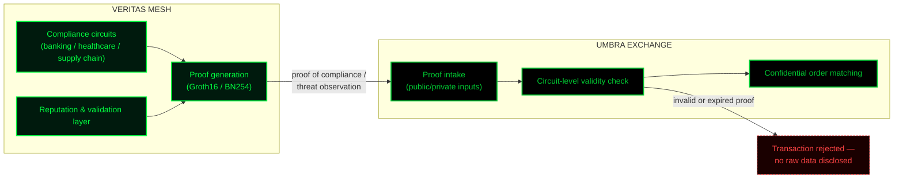

# Architecture

This document explains how the cryptographic projects under this account relate to each other, and why specific primitives were chosen over the alternatives. It exists because a diagram without rationale is decoration; the reasoning is the part worth reading.

## System relationship

Veritas Mesh and Umbra Exchange are **decoupled modules that share a cryptographic scheme (BN254)**, not a single monolithic system. Veritas Mesh is the validation layer — it generates proofs of compliance or threat observation. Umbra Exchange is the settlement layer — it consumes those proofs as inputs and executes confidential order matching. A proof that's invalid or expired is rejected at the circuit level in Umbra; the raw data behind it is never exposed to reject it.

## Why Groth16, not Plonk or Halo2

The deciding factors were tooling maturity, proof size, and verification cost — not a preference for the older scheme in the abstract.

- **Proof size:** Groth16 proofs run roughly 128–256 bytes, the smallest of the widely-used SNARK constructions. That matters when proofs are being verified in resource-constrained contexts (browser-side, or inside smart contracts where verification gas cost is a real budget line).
- **Verification cost:** Groth16 has the lowest verification cost on BN254 of the alternatives considered. Plonk and Halo2 remove the per-circuit trusted setup requirement — a real advantage — but at the cost of larger proofs and materially higher verification overhead.
- **Ecosystem stability:** the `circom` / `snarkjs` / `arkworks` toolchain around Groth16 is mature enough to behave deterministically. The Powers of Tau ceremony is a real cost (per-circuit trusted setup), accepted deliberately in exchange for not debugging compiler surprises in a newer toolchain mid-project.

This is a trade-off, not a free win — the trusted setup requirement is a real constraint on both protocols, and revisiting it (toward Halo2 or a STARK-based scheme) is the most likely reason this section gets rewritten in the future.

## Explicit non-goals

Naming what a system deliberately does not do is as load-bearing as naming what it does — see `MANIFESTO.md`.

- **Recursive proof aggregation (Halo/STARK-style).** Would increase circuit compilation time and debugging complexity exponentially, for a benefit not needed at current scale. Revisit if/when proof volume makes it necessary.
- **Decentralized governance (DAO / tokenomics).** Deliberate decision to keep the architecture focused on cryptographic primitives and infrastructure. Voting smart contracts introduce an attack surface with no relationship to the actual problem being solved.
- **Network-layer anonymity (mixnet / Tor integration).** Both protocols guarantee state integrity and zero-knowledge at the data layer. IP and transport confidentiality is explicitly left to external proxy infrastructure, not reimplemented here.

## Reading this alongside the code

This document describes the intended design. Where an implementation lags the description — for instance, if a non-goal above later turns out to be partially built for testing purposes — the relevant repository's own scope table is the authoritative source, not this file. Update both when they diverge; don't let this page quietly become aspirational.
