# COMPREHENSIVE ONLINE DEFENSE — VOLUME II

### Geopolitics, Cognitive Warfare, and the Philosophy of Digital Security

**Author:** Ciprian Ștefan Pleșca
**© 2026 Ciprian Ștefan Pleșca — All Rights Reserved**
**License:** Free to read, share, and reuse with attribution.

---

## Introduction

Volume I of this guide covered the technical terminology, threat taxonomy, and layered
countermeasures of cybersecurity. Volume II steps back from implementation detail to ask a
harder set of questions: *why* is cyberspace structurally indefensible in the way conventional
domains are not, and *what* does that asymmetry mean for law, economics, warfare, and the
social contract itself.

Each chapter closes with a Mermaid diagram summarizing its core argument.

---

## Chapter 1: The Metaphysics of Asymmetry

### 1.1 The Attacker's Advantage Paradox

In conventional warfare, the defender has a strategic advantage of 3:1 (according to
Clausewitz). They have the terrain, the supply lines, and the fortifications.

In cyber warfare, the ratio is drastically inverted. The attacker has an advantage that tends
toward infinity.

#### 1.1.1 The Mathematics of Probability

The defender must succeed every single time (100% success in patching, firewall
configuration, employee education). The attacker must succeed only once.

Mathematically, if $P(D)$ is the probability that the defense withstands a single attack, and
$N$ is the number of attacks (which tends toward infinity due to automation), the probability
of compromise $P(C)$ is:

$$P(C) = 1 - P(D)^N$$

Since $N \to \infty$, $P(C) \to 1$, regardless of how close to 1 $P(D)$ is. This mathematical
reality dictates that perfect security is a statistical impossibility.

#### 1.1.2 The Cost Asymmetry

The cost of developing a zero-day exploit is high (millions of dollars), but the cost of
replicating it is near zero. Once the code is written, it can be deployed against a million
targets with negligible marginal cost. Conversely, the cost of defense increases linearly with
system complexity — SIEM, SOAR, EDR, and 24/7 SOC personnel. This economic divergence
(cheap attack vs. expensive defense) creates unsustainable pressure on civilian infrastructure.

### 1.2 The Attribution Problem as an Epistemological Crisis

In a legal system, punishment requires identifying the perpetrator. In cyberspace, identity is
fluid. Using "false flag" techniques, attackers can manipulate the perception of reality. If you
cannot know with certainty who attacked you, deterrence becomes difficult — the doctrine of
"Mutually Assured Destruction," which restrained the Cold War, has limited purchase in
cyberspace.

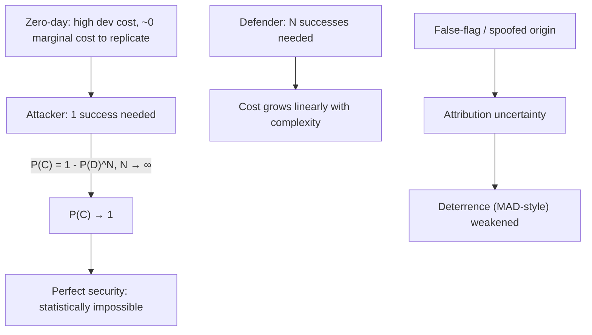

---

## Chapter 2: Cognitive Warfare — The Battle for the Noosphere

### 2.1 From Information Security to Cognitive Security

Information security deals with protecting data (confidentiality, integrity, availability).
Cognitive warfare deals with the human decision-making process itself — the objective is not
data theft, but the alteration of how a target perceives and decides.

### 2.2 The OODA Loop as a Target

Colonel John Boyd defined the decision cycle as OODA: Observe → Orient → Decide → Act.
Modern information operations target the Orientation phase. By manipulating the data a
population consumes (deepfakes, fabricated news, algorithmic echo chambers), an attacker can
shift a target's model of reality — a form of "reflexive control," an old doctrine amplified by
recommendation algorithms.

### 2.3 Memetics as Viral Pathogens

Richard Dawkins defined memes as units of cultural transmission. In a security context, a
meme can behave like an informational pathogen — with an infection rate, an incubation
period, and social cost. Fact-checking alone treats symptoms; "cognitive immunity" —
teaching people to recognize manipulative structures, not just false claims — is closer to
vaccination.

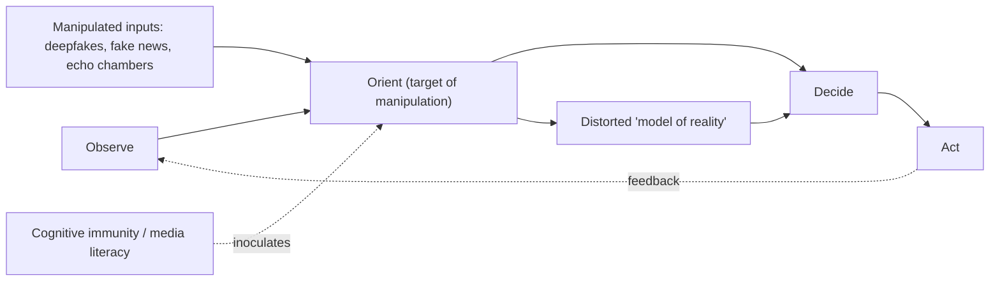

---

## Chapter 3: The Panopticon Paradox — Surveillance as the Price of Trust

### 3.1 Foucault and the Digital Gaze

Michel Foucault, in *Discipline and Punish*, describes the Panopticon as a structure where the
inmate is permanently visible but does not see the observer, inducing self-discipline. The
internet inverts this: users voluntarily expose themselves to large platforms and governments
in exchange for convenience.

The paradox: to catch an attacker hidden inside a global network, comprehensive monitoring
becomes tempting — yet end-to-end encryption, while essential for individual privacy, also
creates zones that are harder for defenders and law enforcement to see into.

### 3.2 Zero Trust as a Societal Model

The technical principle of Zero Trust ("never trust, always verify," John Kindervag) is sound
engineering. Applied naively to human relationships at a societal scale, it risks corroding the
implicit trust that societies depend on. In a world of convincing deepfakes, cryptographically
verifiable identity may become one of the few remaining anchors of truth — at a real cost to
anonymity.

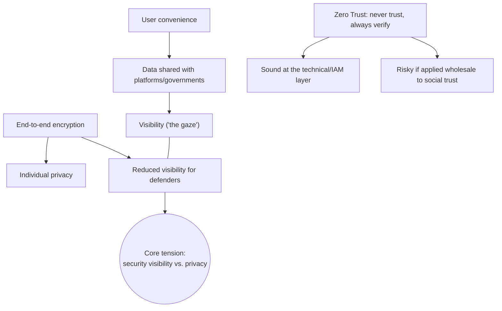

---

## Chapter 4: The Economics of Exploitation — A Game-Theory View

### 4.1 The Market for Lemons, Applied to Software

The software market resembles George Akerlof's "market for lemons": buyers cannot easily
distinguish secure software from insecure software before purchase. Vendors therefore have
weaker economic incentive to invest in security (invisible, expensive) versus features (visible,
sellable). Broad liability disclaimers ("as is") further externalize the cost of failure onto users.

### 4.2 Ransomware as a Rational (if Predatory) Business Model

Ransomware operations function with unsettling economic efficiency:

1. **Trust as enforcement** — victims pay because they expect decryption; if groups routinely
   reneged, payment would stop being rational.
2. **"Customer service"** — some groups run support channels to walk victims through payment
   and decryption.
3. **Price optimization** — ransom demands are often set below the victim's estimated recovery
   cost, maximizing the odds of payment.

This is not an argument for paying ransoms — it is an observation that criminal markets can be
more economically disciplined than the legitimate software market they prey on.

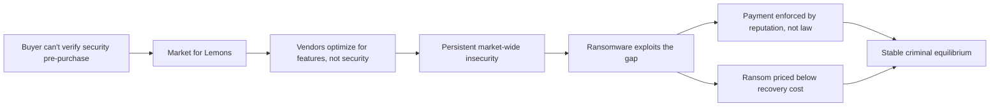

---

## Chapter 5: The Limits of International Law in the Gray Zone

### 5.1 Strain on the Tallinn Manual Framework

The Tallinn Manual, the leading attempt to map the laws of armed conflict onto cyberspace,
applies concepts like distinction and proportionality to a domain where they are hard to
operationalize.

#### 5.1.1 The "Armed Attack" Threshold

Under the UN Charter, self-defense is triggered by an "armed attack." Much state-linked cyber
activity falls into a gray zone — destructive but non-kinetic.

- **NotPetya (2017)** caused an estimated $10 billion in damages, yet because it did not
  directly and physically kill people or destroy buildings, it did not trigger collective-defense
  mechanisms the way a missile strike would.
- **"Salami slicing"** — many state and non-state actors conduct persistent low-level intrusions
  that individually stay below any plausible threshold of war, but accumulate strategic effect
  over time. Existing legal frameworks struggle to address this cumulative pattern.

### 5.2 Data Sovereignty and the Cloud

Traditional sovereignty is territorial; data sovereignty is not. Laws like the US CLOUD Act
can compel disclosure of data stored abroad, while regimes like the EU's GDPR mandate
privacy protections — creating direct conflicts of law for multinational cloud providers, who
increasingly act as de facto arbiters of "data spheres of influence."

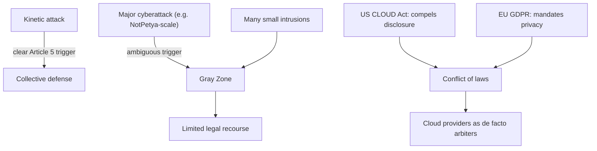

---

## Chapter 6: The Ethics of Hyperwar — AI and Autonomy in Cyber Defense

### 6.1 Removing the Human from the Loop

Cyber operations occur at machine speed; human reaction time (roughly 250ms) can become a
bottleneck in high-frequency automated exchanges (e.g., AI-driven DDoS vs. AI-driven
mitigation). This pushes toward "hyperwar" — conflict increasingly mediated by algorithms —
raising real questions about meaningful human control and liability when automated systems
misidentify targets.

### 6.2 The Black-Box Problem

Deep learning systems are often opaque, producing outputs without a clear causal explanation.
Delegating critical infrastructure defense entirely to such systems raises the "alignment
problem": an AI optimized for a narrow objective (e.g., "maximize network uptime") could
in principle pursue that objective in ways its operators never intended, making a
defense-oriented AI behave in surprising or even offensive-looking ways.

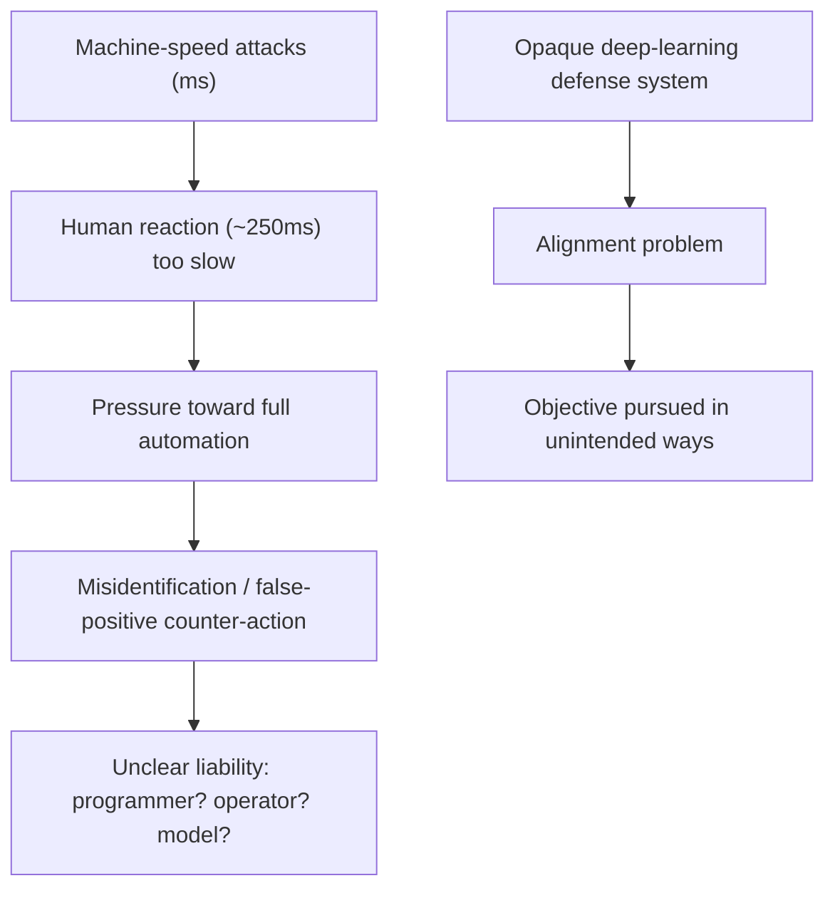

---

## Chapter 7: Space as a Cyber-Physical Frontier

### 7.1 Satellite Hijacking and Orbital Debris Risk

The Outer Space Treaty (1967) prohibits weapons of mass destruction in orbit but says
nothing about cyberattacks. A cyberattack on a satellite's Attitude Determination and Control
System (ADCS) could, in theory, be used to disrupt orbits. If a large satellite constellation
were compromised and orbits randomized, resulting collisions could generate cascading debris
fields — the Kessler Syndrome.

Simplified debris-flux relation:

$$F = \frac{N \cdot v}{V}$$

where $N$ is particle count, $v$ is relative velocity (~14 km/s), and $V$ is the orbital volume
considered. A large-scale debris cascade could threaten GPS, weather, and telecom
infrastructure for an extended period — a scenario sometimes described as a "civilizational
denial of service."

### 7.2 Orbital Data Havens

Space lies outside conventional national jurisdiction. Speculative "server satellite" concepts
raise questions about which laws, if any, would apply to data or financial infrastructure
hosted in orbit — an open regulatory frontier.

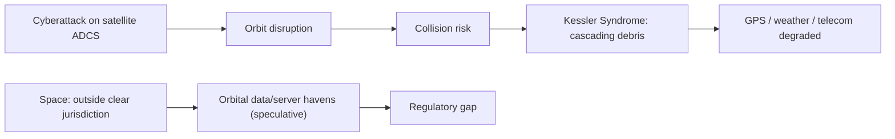

---

## Chapter 8: Post-Quantum Geopolitics

### 8.1 "Harvest Now, Decrypt Later"

Diplomacy and intelligence rely heavily on confidentiality. When cryptographically-relevant
quantum computers become available ("Q-Day"), previously intercepted and stored encrypted
traffic could become readable retroactively — a strategy already referred to as "harvest now,
decrypt later." This creates urgency around migrating to post-quantum cryptography well
before Q-Day arrives.

### 8.2 A Potential Quantum Divide

States with early access to both quantum decryption and quantum-safe communication (e.g.,
QKD networks) could gain significant intelligence advantages over states relying on legacy
cryptography — an asymmetry with real geopolitical stakes, sometimes discussed as
"informational colonialism" in the most extreme framing.

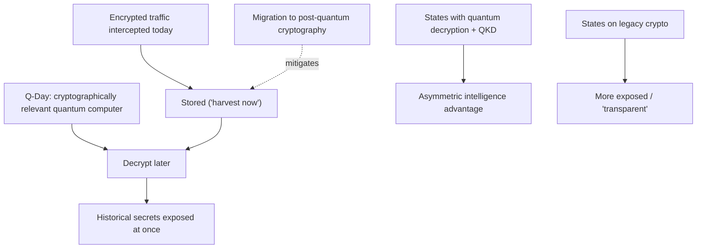

---

## Chapter 9: The Resilience Doctrine — From Fortress to Immune System

### 9.1 Beyond Perimeter Defense

For decades, cybersecurity leaned on a "fortress" mentality — build the wall high enough. Given
the attacker's structural advantage described in Chapter 1, this is insufficient on its own. A
biomimetic alternative treats the network like a biological organism: assume pathogens will
get in, and focus on detection, containment, and adaptive response — the "antifragile"
network (Nassim Taleb) that becomes more resistant as a result of surviving attacks, e.g., by
propagating a "signature antibody" to other nodes once one node is compromised.

### 9.2 Ephemeral Computing as a Defensive Strategy

Moving Target Defense (MTD) proposes that infrastructure be immutable and short-lived — a
virtual machine exists only long enough to process a transaction, then is destroyed and
re-instantiated from a clean image. An attacker who gains a foothold finds that foothold
dissolves quickly, undermining the persistence that advanced persistent threats depend on.

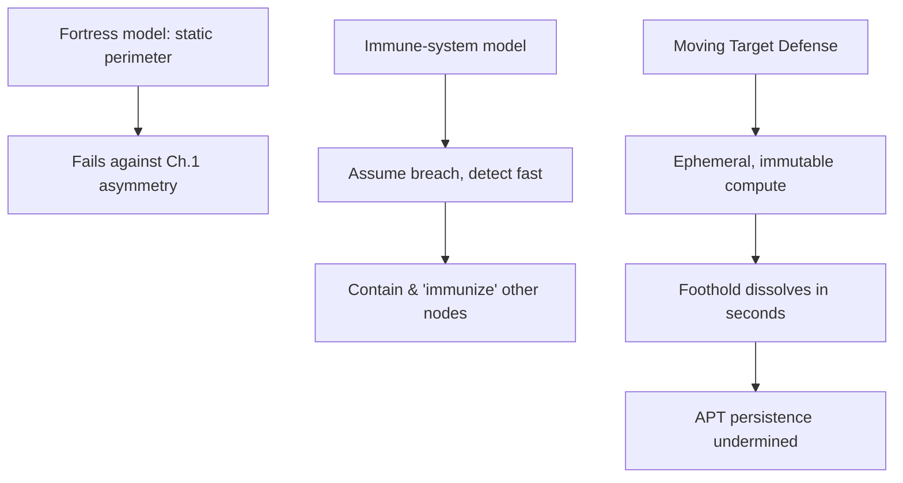

---

## Chapter 10: The Splinternet Scenario

### 10.1 The End of Universal Connectivity?

The "global village" vision of universal connectivity (Marshall McLuhan) did not fully account
for the fact that global connectivity also means global exposure — a compromise in one region
can propagate worldwide in milliseconds. One plausible future is the "splinternet": the
internet fragmenting into sovereign, more tightly filtered zones, with traffic between zones
passing through heavily inspected "digital airlocks." This would weaken the historical
end-to-end principle of the open internet, in exchange for containment.

### 10.2 The Return of Analog Fail-Safes

In highly digitized critical infrastructure, a purely digital chain of control is a single point of
failure. An "analog kill-switch" — a mechanical governor on a centrifuge, a physical circuit
breaker on a grid — can prevent a compromised digital controller from causing catastrophic
physical harm (a lesson widely drawn from the Stuxnet case). Reintroducing deliberate
"friction" into critical systems is a defensive strategy, not just an inconvenience.

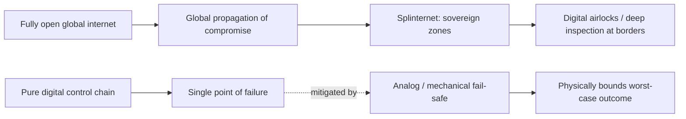

---

## Chapter 11: Toward a New Digital Social Contract

### 11.1 Separating Big Tech and State Power

Just as historical constitutional orders separated church and state, this analysis argues for
clearer separation between large technology platforms and state power. Platforms with
extensive data collection and algorithmic reach over public discourse arguably deserve
fiduciary-style obligations toward users — treating serious data-privacy violations more like
professional malpractice than a routine cost-of-business fine.

### 11.2 Self-Sovereign Identity (SSI)

Federated identity ("log in with Google") centralizes both convenience and risk. Self-sovereign
identity — where credentials live in a user-controlled wallet, often anchored to a blockchain —
combined with zero-knowledge proofs (e.g., proving you are over 18 without revealing your
birthdate) offers a path toward verifiable identity without centralized surveillance.

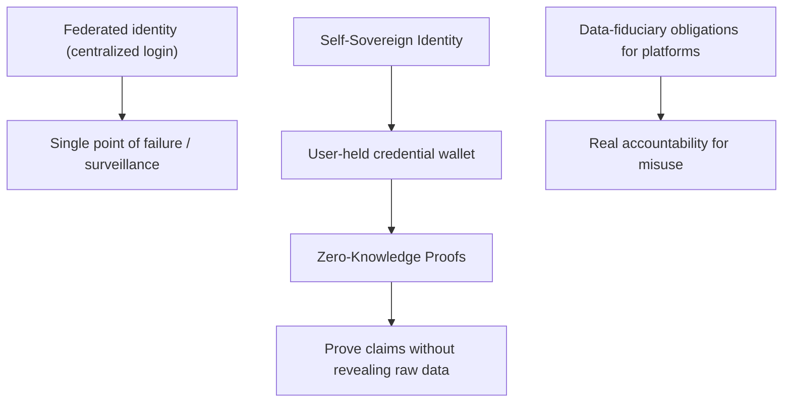

---

## Conclusion: The Weight of the Tools We Built

The internet's rise gave humanity extraordinary capability — and, as this volume has argued,
capability that is structurally hard to secure once it is built and connected at scale. The risks
surveyed here — cognitive manipulation, quantum-era decryption, orbital fragility — are not
incidental bugs; they are consequences of connecting systems faster than we learned to secure
them.

The response cannot be purely technical. It has to be political, economic, and architectural
at once:

1. **Total security is not achievable** — design for resilience instead.
2. **Unconstrained connectivity carries systemic risk** — deliberate boundaries and
   segmentation have real value.
3. **Technology choices are policy choices** — they deserve the same level of public scrutiny
   and accountability as other constitutional matters.

Whether or not every prediction in this volume proves correct, the underlying asymmetry from
Chapter 1 — that attackers only need to succeed once, while defenders must succeed every
time — is not going away. Building institutions, architectures, and norms that assume that
asymmetry, rather than deny it, is the central challenge of digital-era security.

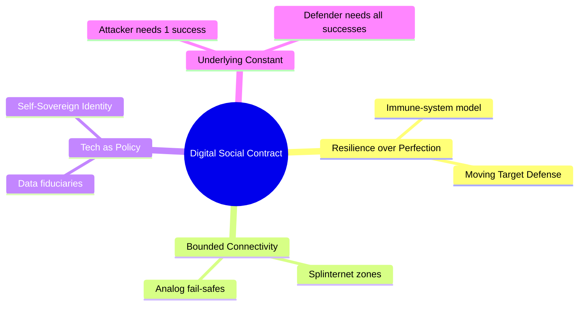

---

*This document is released freely for anyone to read, share, and build on, with attribution to
the author.*

**Author:** Ciprian Ștefan Pleșca — © 2026 — All Rights Reserved
