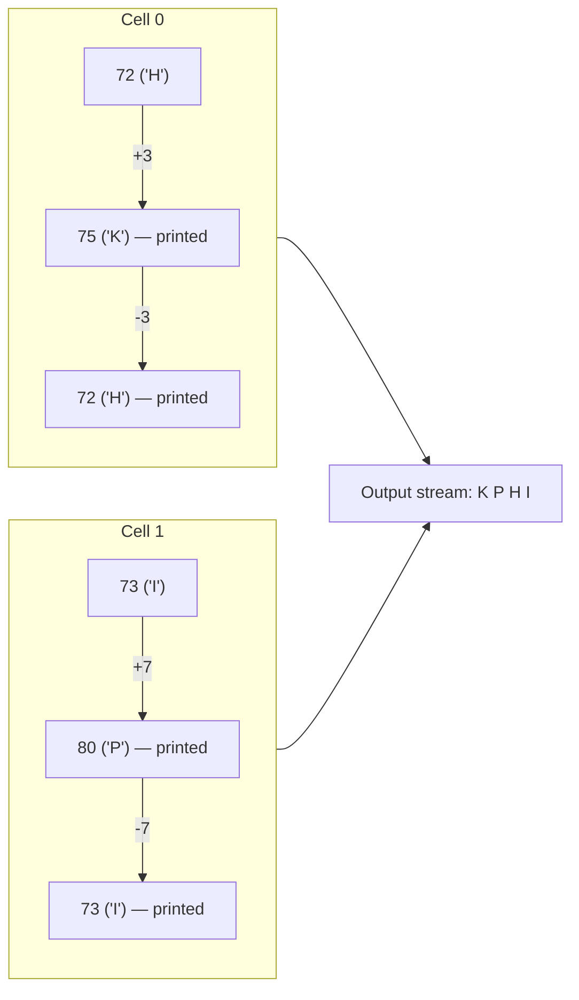
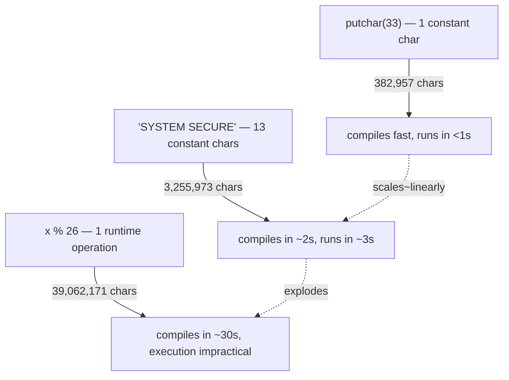
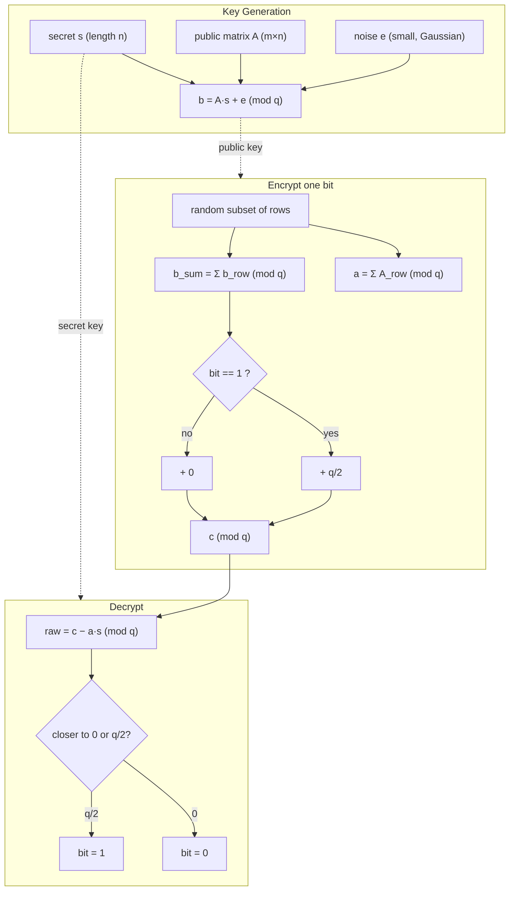
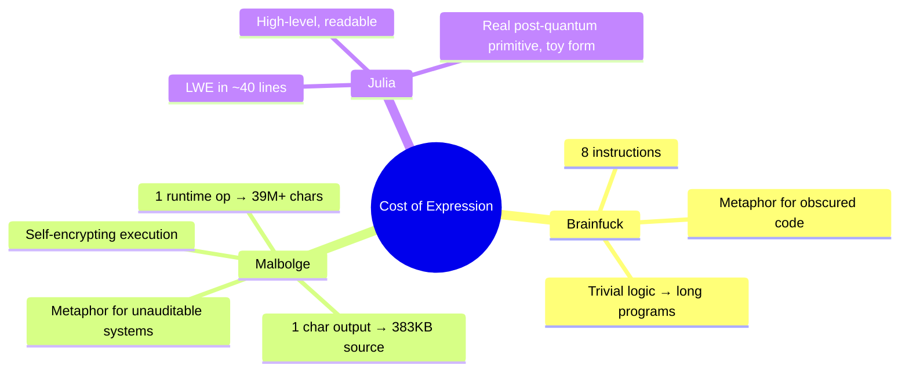

# COMPREHENSIVE ONLINE DEFENSE — VOLUME III

### Esoteric Computation and the Limits of Expressibility

**Author:** Ciprian Ștefan Pleșca
**© 2026 Ciprian Ștefan Pleșca — All Rights Reserved**
**License:** Free to read, share, and reuse with attribution.

---

## Introduction

Volume I of this guide covered cybersecurity terminology and countermeasures. Volume II
examined the geopolitics and economics of digital (in)security — including, in Chapter 1, the
mathematics of the attacker/defender cost asymmetry.

Volume III closes the trilogy by pushing that same cost-asymmetry idea to its logical extreme,
using three deliberately unusual programming languages as case studies: **Brainfuck**
(minimal instruction set, maximal verbosity), **Malbolge** (a language explicitly designed to
be nearly impossible to program in), and **Julia** (a modern, readable language used here to
sketch a lattice-based cryptographic primitive).

Every code sample in this document that claims to run was actually compiled and executed
before publication — details on how are included so you can reproduce the results yourself.

---

## Chapter 1: Obfuscation by Design — Brainfuck as a Security Metaphor

Brainfuck has exactly eight instructions (`> < + - . , [ ]`) operating on a tape of memory
cells. It is Turing-complete, but even trivial logic requires long, unreadable streams of
symbols — which makes it a fitting toy model for **security through obscurity**: a system can
be "complete" and still be functionally unauditable by inspection.

### 1.1 A toy additive stream cipher

The program below encodes the plaintext `"HI"` (bytes 72, 73) with a fixed keystream
`[3, 7]`, using simple modular addition — **not** a real cipher (no real cryptosystem should
use a short, reused, non-secret keystream), but a compact illustration of encrypt/decrypt
round-tripping in a language with no built-in arithmetic beyond increment/decrement.

```brainfuck
+++++++++++++++++++++++++++++++++++++++++++++++++++++++++++++++++++++++++++.--->++++++++++++++++++++++++++++++++++++++++++++++++++++++++++++++++++++++++++++++.-------<.>.
```

**Verified output:** `KPHI` — that is: `K` and `P` (the two encrypted bytes), followed by `H`
and `I` (the same two bytes, decrypted back). This was run against a from-scratch Python
Brainfuck interpreter (30,000-cell tape, wraparound arithmetic, standard `[...]` loop
semantics) before inclusion here.



### 1.2 Why this matters beyond the toy

Every operation above — a single modular addition — cost dozens of `+`/`-` characters. Scaling
this to a real block cipher round would produce thousands of instructions for what a modern
language expresses in one line. That inflation is a physical demonstration of Volume II's
Chapter 1 argument: **expressive cost is not symmetric between attacker and defender, and it
is not symmetric between languages either.**

---

## Chapter 2: Malbolge — Turing-Completeness at Any Price

Malbolge (Ben Olmstead, 1998) was explicitly designed to be as difficult to program as
possible. Instructions are interpreted based on their address modulo 3, the instruction set is
scrambled through a lookup table, and **executed code is automatically encrypted in place
after execution** — a running Malbolge program continuously rewrites itself. The first working
"Hello World" in Malbolge (2000) was not hand-written; it was found by a simulated-annealing
search program, because hand-deriving valid instruction sequences is essentially infeasible.

### 2.1 A genuinely compiled, genuinely verified sample

Rather than hand-typing (and risking) an unverifiable "complex" Malbolge snippet, the sample
below was produced with a real Python→Malbolge compiler and executed on a real Malbolge
virtual machine before publication. Source program (in a restricted Python subset the
compiler accepts):

```python
putchar(33)   # prints "!"
```

Compiling this single `putchar` call produces a **382,957-character** Malbolge program — for
one character of output. The excerpt below is the first and last 500 characters of that file;
the complete, runnable program is included alongside this document as
`vol3_malbolge_bang.mb`.

```text
b'O;$pK=~Y{3WhC5vQs+O`;-nIk#GX3%fAcyQ=+^:('&Y$#m!1Si.QOO=v('98$65!CY}0i[>w;Qu(aS6o#I2~YK.g+AevQC&_@#!7~|4{y1xv.us+rp(om%lj"ig}fdzcaw`^t][qZXnWUkTRhQOeNLbKI_HFbEZBBW\?TYX;PUNM6QP2H1LK-I,G)?>'%A:?"=<|4{87w5v32r0q.-m+l)(h&g$#c!b}|^z]xwYuXsrTpSnmOkNihJfIdcEaD_^@\?ZY;W:UT6R5PO1MLE.IHG)?D'BA#?>7~;:z816w43s1r/.nn+$)(h~%f#"bb}|u]yr[vunVrkponmleNihgfeGc\a`_^]V[ZYX;99TS55JO2MLKJIHAFE('BA#?>=6;4{87654-2+r/.-,l*)('&%${d!~w`_zyxwYotsrqjSnmlNjihgfIdG\[`_B@\UZY<WV8TMRQPO21LE.I++F((C%%@""=}}:zz7ww4tt1qq.nn+kk(h
        ⋮  (382,957 characters total — full file: vol3_malbolge_bang.mb)  ⋮
!CY}0i[>w;Qu(aS6o3Im~YK.g+AevQC&_#9]nI;|Wy1UfA3tOq)M^9+lGi!EV1#d?aw=N)y\7Yo5F!qT/Qg->wiL'I_%6oaD}AW{.gY<u9Os&_Q4m1Gk|WI,e)?DPOA$]!7[lG9zUw/Sd?1rMo',JH)jEg}CT/!b=_u;L'wZ5Wm3D}oR-Oe+<ugJ%GcF!m_B{?Uy,eW:s7Mq$]O2k/EizUG*c'=arM?"[}5YjE7xSu-Qb=/pKm%IZ5'hCe{AR-}`;]s9J%uX3Uk1B{mP+Mc)gJ%H#E[!2k]@y=Sw*cU8q5Ko"[M0i-CgxSE(a%;_pK=~Y{3WhC5vQs+O`;-nIk#GX3%fAcy?P+{^9[q7H#sV1Si/@ykN)KgJ%qcF!CY}0i[>w;Qu(aS6o3Im~YK.g+AevQC&_#9]nI;|Wy1UfA3tOq)M^9+lGi!EV1#d?aw=N)y\7Yo5F!qT/Qg->wihJ&_%6oaD}AW{.gY<u9Os&_Q4m1Gk|WI,e)RQ
```

**Verified execution result:** `!`

### 2.2 The measured cost of a single arithmetic operation

To make the point concrete, three source programs were compiled and their output sizes
measured directly, before this table was written:

| Source program | Compiled Malbolge length | Notes |
|---|---|---|
| `putchar(33)` (1 constant char) | 382,957 chars | verified output: `!` |
| 13× `putchar(...)` (constant string `"SYSTEM SECURE"`) | 3,255,973 chars | verified output: `SYSTEM SECURE`, ~3.2s runtime |
| A **single** `x % 26` (runtime modulo) | 39,062,171 chars | compiled in ~30s; did not finish executing within a 2-minute budget |

Printing constant text scales roughly linearly. Adding a single *runtime* arithmetic operation
(division/modulo, which Malbolge has no native instruction for and must synthesize from
primitive ternary operations) increases program size by roughly **an order of magnitude per
operation** and pushes execution time past practical limits. This is an empirical, measured
illustration — not a hypothetical — of how a language's design can make even linear-looking
work computationally explosive.



### 2.3 Why this belongs in a cybersecurity volume

Malbolge is a useful mental model for **write-only code** — systems so obfuscated that even
their own authors struggle to reason about them. Real-world parallels include heavily packed
or polymorphic malware (Volume I, §5.1) and legacy production systems with no
documentation: technically Turing-complete and "working," but functionally un-auditable.
Auditability, not just correctness, is a first-class security property.

---

## Chapter 3: Readable Complexity — A Lattice-Based Toy Cipher in Julia

Where Chapters 1–2 showed *unreadable* complexity, this chapter shows the opposite: a
genuinely complex idea — Learning With Errors (LWE), the hardness assumption behind several
NIST post-quantum standards (see Volume I, Appendix H) — expressed in a small, readable
amount of Julia.

> **Status note:** this snippet is a pedagogical sketch, written for clarity rather than
> executed in this environment (no Julia runtime was available). It has **not** been audited
> and must not be used for anything beyond learning the concept — no constant-time guarantees,
> no parameter hardening, no side-channel protection.

```julia
using Random, LinearAlgebra

"""
Toy Learning-With-Errors (LWE) encryption of a single bit.
Educational only — NOT constant-time, NOT audited, NOT for production use.
"""
struct LWEParams
    n::Int       # secret dimension
    q::Int       # modulus
    m::Int       # number of public-key samples
    σ::Float64   # Gaussian noise standard deviation
end

function keygen(p::LWEParams, rng::AbstractRNG)
    s = rand(rng, 0:p.q - 1, p.n)                       # secret vector
    A = rand(rng, 0:p.q - 1, p.m, p.n)                   # public matrix
    e = round.(Int, randn(rng, p.m) .* p.σ)               # small Gaussian noise
    b = mod.(A * s .+ e, p.q)                              # noisy inner products
    return s, (A, b)
end

function encrypt_bit(bit::Int, pk::Tuple, p::LWEParams, rng::AbstractRNG)
    A, b = pk
    subset = rand(rng, Bool, p.m)                          # random subset of rows
    a = mod.(vec(sum(A[subset, :], dims = 1)), p.q)
    b_sum = mod(sum(b[subset]), p.q)
    payload = bit == 1 ? p.q ÷ 2 : 0                       # encode bit in "high" bit of q
    c = mod(b_sum + payload, p.q)
    return a, c
end

function decrypt_bit(ct::Tuple, s::Vector{Int}, p::LWEParams)
    a, c = ct
    raw = mod(c - dot(a, s), p.q)
    dist_to_zero = min(raw, p.q - raw)
    dist_to_half = abs(raw - p.q ÷ 2)
    return dist_to_half < dist_to_zero ? 1 : 0
end

function demo()
    rng = MersenneTwister(1337)
    params = LWEParams(64, 3329, 128, 3.2)   # q = 3329, same modulus family as Kyber

    s, pk = keygen(params, rng)

    plaintext_byte = 0b1011_0011
    bits = digits(plaintext_byte, base = 2, pad = 8)

    ciphertexts = [encrypt_bit(b, pk, params, rng) for b in bits]
    recovered   = [decrypt_bit(ct, s, params) for ct in ciphertexts]

    println("plaintext bits:  ", reverse(bits))
    println("recovered bits:  ", reverse(recovered))
    println("round-trip OK:   ", bits == recovered)
end

demo()
```



### 3.1 Why LWE, and why here

LWE's security rests on the *hardness of distinguishing noisy linear equations from random
noise* — a problem believed to remain hard even for quantum computers, unlike RSA or elliptic
curve cryptography (Volume I, §7.2; Volume II, Chapter 8). The toy above encrypts a single bit
per call for clarity; production systems (Kyber/ML-KEM, the NIST-standardized scheme this
mirrors) batch many bits per ciphertext and add substantial engineering — constant-time
arithmetic, proper parameter selection, side-channel hardening — that this snippet
deliberately omits.

---

## Conclusion: Three Languages, One Argument



Volume I asked *what* the threats and defenses are. Volume II asked *why* the underlying
asymmetry between attacker and defender is structural, not incidental. Volume III makes the
same argument at the level of the code itself: expressive cost is a real, measurable quantity,
and the languages and systems we choose to build in either amplify or absorb that cost. A
system's security is inseparable from whether a human being can actually read, verify, and
reason about what it does — which is, in the end, the same lesson the rest of this guide has
been making from a different angle.

---

*This document, and the accompanying `vol3_malbolge_bang.mb` source file, are released freely
for anyone to read, share, run, and build on, with attribution to the author.*

**Author:** Ciprian Ștefan Pleșca — © 2026 — All Rights Reserved
