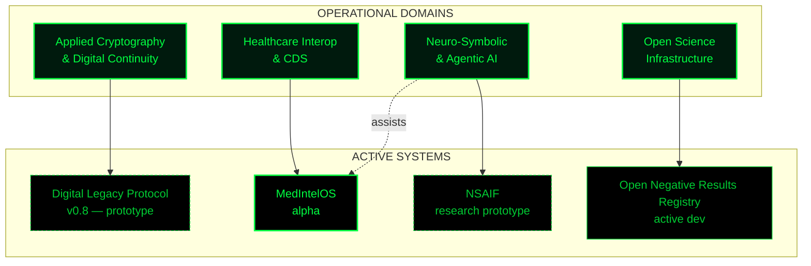
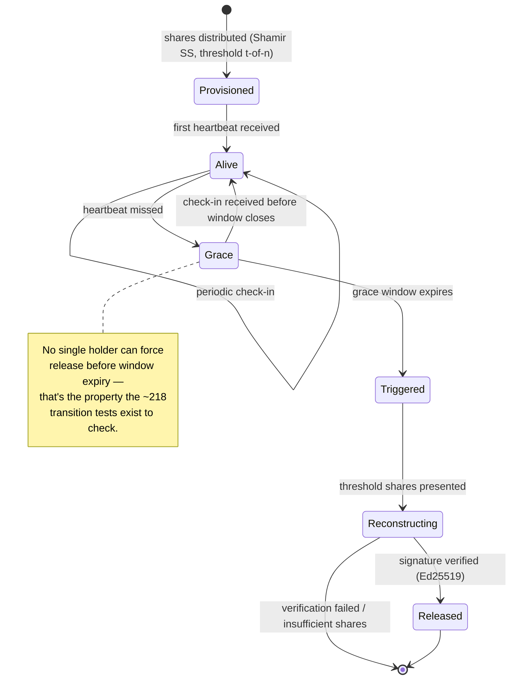

<div align="center">


<br/>


[](https://github.com/Ciprian-LocalPulse)
[](https://github.com/Ciprian-LocalPulse)

</div>

---

```
██████████████████████████████████████████████████████████████████████
█  MISSION CONTROL // OPERATOR LOG                                    █
██████████████████████████████████████████████████████████████████████

  CALLSIGN .......... Ciprian Stefan Plesca
  BASE ............... Piatra Neamt, Romania (EU)
  DOMAIN .............. Applied Cryptography / Biomedical Infra / AI Systems
  MODE ................ Solo operator, open-source, continuous deployment
  CLOCK ............... T+ [ see commit history — no fabricated uptime here ]

  TRANSMISSION: All systems below are built and maintained by one person.
  No team badge, no fake org chart. What you see is what was built.
██████████████████████████████████████████████████████████████████████
```

---

<div align="center">

## `>_ SYSTEMS MAP`

</div>



<div align="center">

## `>_ ACTIVE MISSIONS`

</div>

```
┌──────────────────────────────────────────────────────────────────────┐
│ MISSION 01 // DIGITAL LEGACY PROTOCOL                                │
│ ---------------------------------------------------------------------│
│ Cryptographic dead-man's-switch for verifiable digital inheritance.  │
│ Shamir's Secret Sharing · Ed25519 · state-machine core.              │
│ STAGE: v0.8 — research prototype — ~218 tests on core transitions.   │
│ NOT YET: third-party audited.                                        │
└──────────────────────────────────────────────────────────────────────┘

┌──────────────────────────────────────────────────────────────────────┐
│ MISSION 02 // MEDINTELOS                                             │
│ ---------------------------------------------------------------------│
│ FHIR R5 · CDS Hooks · federated learning · consent smart contracts.  │
│ STAGE: alpha — educational reference implementation.                 │
│ NOT: a certified EHR. Says so in its own README.                     │
└──────────────────────────────────────────────────────────────────────┘

┌──────────────────────────────────────────────────────────────────────┐
│ MISSION 03 // OPEN NEGATIVE RESULTS REGISTRY                         │
│ ---------------------------------------------------------------------│
│ Schema + ingestion pipeline for publishing null findings in          │
│ biomedical research. Target: publication bias.                       │
│ STAGE: active development.                                           │
└──────────────────────────────────────────────────────────────────────┘

┌──────────────────────────────────────────────────────────────────────┐
│ MISSION 04 // NSAIF                                                  │
│ ---------------------------------------------------------------------│
│ Neuro-symbolic reasoning + adaptive agents (ReAct, CoT).             │
│ STAGE: research prototype / testbed.                                 │
└──────────────────────────────────────────────────────────────────────┘

┌──────────────────────────────────────────────────────────────────────┐
│ MISSION 05 // COMPREHENSIVE ONLINE DEFENSE (VOL. I – III)            │
│ ---------------------------------------------------------------------│
│ Free three-part cybersecurity reference. Vol. I: terminology, threat │
│ taxonomy, and countermeasures from user- to expert-level. Vol. II:   │
│ essay on the geopolitics, economics, and philosophy of cyber         │
│ (in)security. Vol. III: esoteric-language case studies (Brainfuck,   │
│ Malbolge, Julia) on the measured cost of expressive complexity —     │
│ every code sample compiled/run and verified before publication.      │
│ STAGE: complete — trilogy closed, released for free reuse with       │
│ attribution.                                                          │
└──────────────────────────────────────────────────────────────────────┘
```

---

<div align="center">

## `>_ PROTOCOL DEEP DIVE — DIGITAL LEGACY PROTOCOL`

*State machine below is illustrative of the documented design — verify against `src/` before treating it as authoritative.*

</div>



---

<div align="center">

## `>_ SIGNAL / SYSTEM METRICS`


</div>

---

```
>_ TRANSMISSION LOG

  [OK] Every mission above states its own maturity level.
  [OK] No claim of certification, deployment, or clinical use
       that isn't documented inside the repository itself.
  [OK] Diagrams are documentation, not decoration — each maps
       to a real state machine or dependency, not an aesthetic.
  [!!] Independent code review: not yet received. Actively wanted —
       open an issue if you find something broken.
```

---

<div align="center">

## `>_ CONNECT`

[](https://agentflow-enterprise.com/)
[](https://www.linkedin.com/in/stefan-ciprian-plesca/)
[](https://cal.com/ciprian-stefan-plesca)

<br/>

```
> END OF TRANSMISSION_
```


</div>
