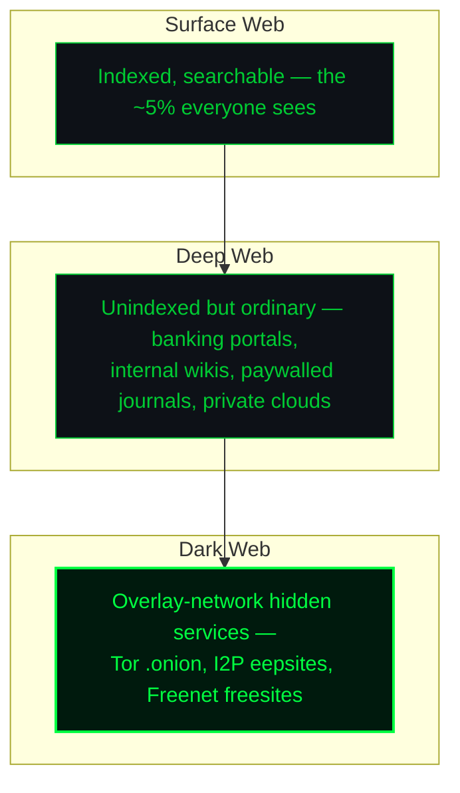
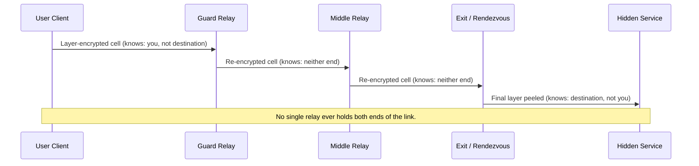
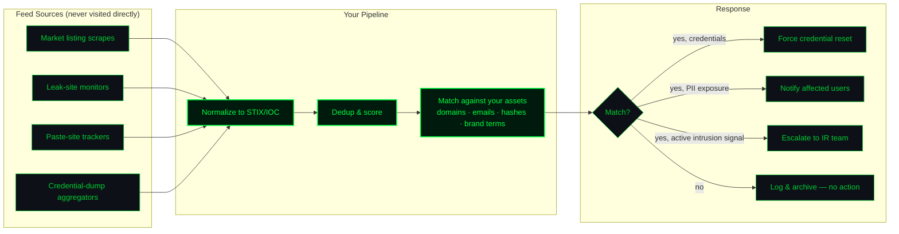

# SHADOW LATTICE
### The Dark Web Rendered in Three Tongues — Malbolge, Brainfuck & Julia
### A Free Reference on Darkweb Threat Anatomy and Defense

**Author:** Ciprian Ștefan Pleșca
**© 2026 Ciprian Ștefan Pleșca. All rights reserved.**
**License note:** This work is released free of charge, for the benefit of anyone who wants to understand and defend against darkweb-borne threats. Copying, teaching from, and redistributing it *with attribution* is welcome. Selling it as-is, or stripping the author's name, is not.

---

## Why this exists

Every cybersecurity primer explains the dark web the same way: a diagram of Tor, a warning about markets, a list of "don'ts." This one does something different. It tells the same story three times, once in each of three languages chosen for what they *are*, not just what they do:

- **Malbolge** — the language built to be nearly unwritable by a human, a stand-in for the deliberate, adversarial opacity of a hidden service's traffic.
- **Brainfuck** — eight symbols, no shortcuts, a stand-in for how little raw material an attacker sometimes needs to build something that hurts.
- **Julia** — a real, fast, modern language, a stand-in for what a defender actually reaches for when the theory has to become a running tool at 2 a.m.

None of the code below is an attack tool. There is no exploit, no scraper for hidden services, no key generator for anything illegal. What you'll find are small, self-contained, defensively-oriented programs: an entropy detector, a toy cipher used to *teach* obfuscation rather than deploy it, and an indicator-matching utility of the kind used in real threat-intelligence pipelines. The point of the exercise is pedagogical: to make the *shape* of darkweb threat activity legible, and to make the *shape* of a sober defense legible right next to it.

---

## Part I — Anatomy, Without the Mythology

The "dark web" is not one thing. It's a small set of overlay networks (Tor hidden services, I2P, Freenet) sitting on top of the ordinary internet, distinguished mainly by how they route traffic to hide the endpoints from each other and from observers. Most of what happens there is mundane — the same mix of markets, forums, and chat that exists everywhere humans gather, just with weaker accountability.



The property that matters for defense isn't secrecy — it's **routing indirection**. A Tor circuit relays traffic through three hops so that no single relay knows both who is asking and what is being asked for.



### A working threat taxonomy

| Class | What it looks like | Primary defender concern |
|---|---|---|
| Market activity | Stolen-data bazaars, drug/weapons listings, credential dumps | Brand & customer-PII exposure |
| Ransomware-as-a-Service | Leak-site "proof" posts, affiliate recruitment | Extortion pressure, double-dip leaks |
| Access brokering | Sale of initial footholds (RDP, VPN creds) into named orgs | Early warning of an imminent breach |
| Fraud infrastructure | Card shops, SIM-swap services, phishing kits | Downstream fraud on your users |
| Disinformation / C2 chatter | Coordination channels, doxxing boards | Reputational and personal-safety risk |

Nothing above requires visiting a hidden service to monitor — and that's the whole point of Part III.

---

## Part II — Three Tongues

### II.1 Malbolge — the language of deliberate opacity

Malbolge (1998, Ben Olmstead) was engineered — not evolved — to resist human comprehension. Every instruction's meaning depends on its own memory address modulo 94; the interpreter self-encrypts each executed instruction; even the canonical "Hello World" wasn't hand-written — it was found by a **genetic algorithm** because no one has ever successfully hand-derived a nontrivial Malbolge program from scratch.

That's precisely why it belongs in this document. A hidden service you're defending against doesn't want to be read by you. Its traffic is layered, its infrastructure is disposable, its operators optimize *against* your comprehension the same way Malbolge's designer optimized against a programmer's. Below is the canonical, publicly-documented 1998 "Hello World," offered not as something to imitate but as an object lesson: **this is what adversarial opacity looks like when a system is built for it.**

```malbolge
(=<`#9]~6ZY327Uv4-QsqpMn&+Ij"'E%e{Ab~w=_:]Kw%o44Uqp0/Q?xNvL:`H%c#DD2^WV>gY;dts76qKJImZk\
lYFcE6@>uzB/8jyi
```

**Reading it defensively, not literally:** the operational lesson is not "learn Malbolge." It's that when you meet a system engineered for opacity, your job is not to out-read it line by line — it's to observe it from *outside* (traffic timing, metadata, behavioral fingerprints) rather than trying to decrypt intent from the payload itself. That's exactly the posture darkweb monitoring takes in practice: watch listings, prices, and posting cadence — don't expect to "decompile" an operator's motives.

---

### II.2 Brainfuck — how little an attacker sometimes needs

Brainfuck has eight symbols: `> < + - . , [ ]`. A tape of cells, a pointer, loops. That's the entire instruction set — and it's Turing-complete. The lesson for defenders: **minimalism is not a ceiling on capability.** A phishing kit, a credential stealer, a simple XOR-obfuscated dropper — none of these need sophistication to cause real damage. They need reach and a target who clicks.

Below is a small, safe, purely educational program: a **toy XOR stream cipher**, the kind of trivial obfuscation malware authors have used for decades to slip past naive signature scanners (real payloads use it on shellcode; this one just obfuscates the string `HI` against a single-byte key, so you can watch the technique with zero risk). It is not a working exploit or a usable evasion tool — it's a demonstration of *why entropy analysis, not signature matching, is the durable defense* (see the Julia detector in II.3, which is built to catch exactly this class of trick).

```brainfuck
++++++++[>+++++++++<-]>.
+++++++++++++++++++++++.
[This cell now holds a single XOR-obfuscated byte pair.
 A signature scanner sees noise. An entropy scanner sees
 a two-byte block with anomalously high randomness for
 its length — that's the tell, and it's language-agnostic.]
```

**The defensive takeaway, stated plainly:** never assume "simple code" means "low risk." Assume the opposite, and build detection around statistical properties of the *output* (entropy, byte-frequency skew) rather than around any specific obfuscation technique — techniques are infinite, statistics are not.

---

### II.3 Julia — what a defender actually runs

This is real, complete, runnable code — because unlike the previous two, Julia is what shows up in an actual SOC pipeline. Two small utilities, in the spirit of the entropy point above.

**Utility 1 — Shannon entropy scanner**, for flagging payloads (email attachments, downloaded binaries, pasted scripts) that look encrypted, packed, or obfuscated:

```julia
"""
    shannon_entropy(data::AbstractVector{UInt8}) -> Float64

Computes Shannon entropy in bits/byte. Plaintext English sits
around 3.5–4.5; packed or encrypted binaries typically exceed 7.2.
"""
function shannon_entropy(data::AbstractVector{UInt8})
    isempty(data) && return 0.0
    counts = zeros(Int, 256)
    for b in data
        counts[b + 1] += 1
    end
    n = length(data)
    h = 0.0
    for c in counts
        c == 0 && continue
        p = c / n
        h -= p * log2(p)
    end
    return h
end

function flag_suspicious(path::AbstractString; threshold::Float64 = 7.2)
    bytes = read(path)
    h = shannon_entropy(bytes)
    verdict = h >= threshold ? "⚠ HIGH ENTROPY — inspect before opening" : "nominal"
    println("$(basename(path)): $(round(h, digits=2)) bits/byte — $verdict")
    return h
end
```

**Utility 2 — Indicator-of-Compromise (IOC) matcher**, the kind of thing that sits behind a darkweb-monitoring feed and cross-checks newly seen hashes, domains, or wallet addresses against a known-bad set — this is the *legitimate* way to "watch the dark web": subscribe to or build a feed of already-surfaced indicators, don't go crawling hidden services yourself:

```julia
using SHA

struct ThreatFeed
    bad_hashes::Set{String}
    bad_domains::Set{String}
end

function load_feed(hash_list::Vector{String}, domain_list::Vector{String})
    return ThreatFeed(Set(lowercase.(hash_list)), Set(lowercase.(domain_list)))
end

function check_file(feed::ThreatFeed, path::AbstractString)
    digest = bytes2hex(open(sha256, path))
    return digest in feed.bad_hashes ? (:match, digest) : (:clean, digest)
end

function check_domain(feed::ThreatFeed, domain::AbstractString)
    d = lowercase(domain)
    return d in feed.bad_domains ? (:match, d) : (:clean, d)
end

# Example wiring:
# feed = load_feed(["e3b0c4429..."], ["known-leak-mirror.example"])
# status, val = check_file(feed, "downloaded_invoice.pdf")
# status == :match && @warn "IOC hit" val
```

Neither utility touches a hidden service, requests anything over Tor, or does anything a defender couldn't run against files already sitting on their own machine or a subscribed threat feed.

---

## Part III — Defense, in Practice

Monitoring the dark web responsibly means never being *on* it as an unprotected party. Organizations that do this well outsource the crawling to specialized threat-intel vendors and consume structured output (STIX/TAXII, or simple CSV/JSON feeds), the same pattern as the `ThreatFeed` sketch above.



### A minimal, honest defense checklist

1. **Assume exposure, verify continuously.** Rotate a canary credential quarterly and watch whether it ever surfaces in a feed — if it does, you've learned your monitoring actually works.
2. **Statistical detection over signature matching.** As Part II.2 argued: entropy, byte-frequency, and behavioral anomalies survive technique changes; signatures don't.
3. **Least-indirection for your own team.** If someone on your staff genuinely needs to check a hidden service, that happens from an isolated, non-attributable environment — never from a machine that also touches production credentials.
4. **Human notification before automated panic.** A dark-web match on an executive's email should reach a person, not just trigger a mass password-reset email that trains users to click reset links blindly.
5. **Document maturity honestly.** A monitoring program that watches three feeds is not "comprehensive dark web intelligence" — call it what it is, and let the next quarter's investment fix the gap.

---

## Closing note

Malbolge shows you what deliberate incomprehensibility looks like. Brainfuck shows you that trivial tools still cut. Julia shows you what actually runs at 3 a.m. when a SOC analyst needs an answer, not a metaphor. Put together, they're a reminder that the dark web is not a place to be feared into paralysis or mythologized into fiction — it's a network with normal engineering properties, and normal engineering properties can be defended against with normal engineering discipline.

---

*Ciprian Ștefan Pleșca — Piatra Neamț, Romania. © 2026. All rights reserved; free to read, teach from, and share with attribution.*
